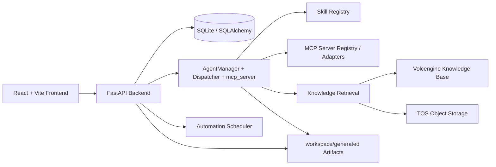
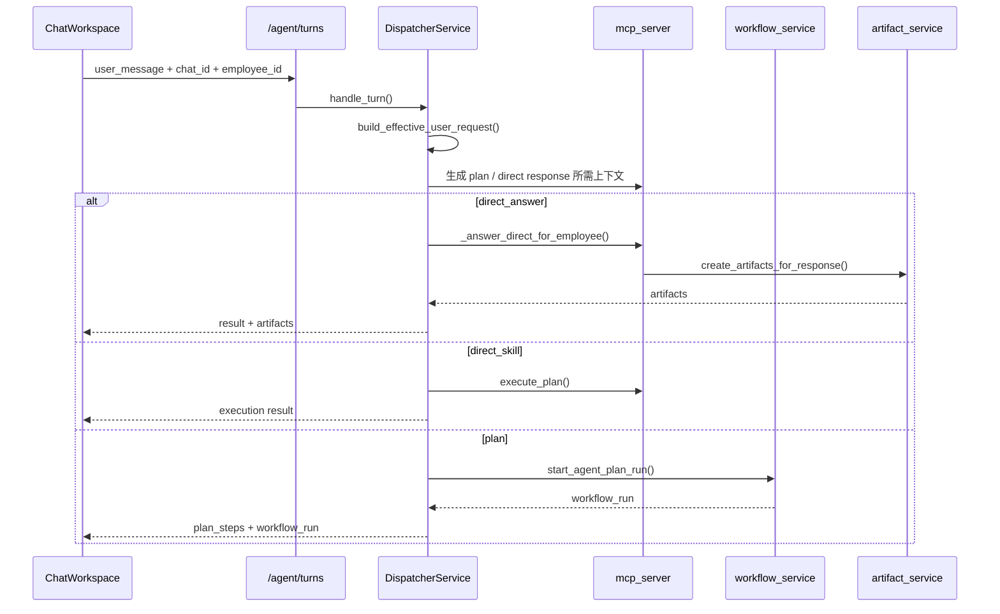

# DES 系统技术架构与实现链路

## 1. 文档目的

本文档基于当前仓库代码整理，目标是让新的架构师或开发同学能够快速理解以下内容：

- 当前系统前端、后端分别采用什么框架和组织方式
- 主要业务模块分别落在什么目录、由哪些入口串起来
- 对话、自动化任务、知识库、Skill/MCP 等核心功能的真实执行链路
- 二次开发时应该从哪里下手，如何沿着调用链排查问题

本文档描述的是当前实现，不是理想化设计稿。

---

## 2. 系统总览

DES 当前是一个典型的前后端分离应用：

- 前端目录：`react-des/`
- 后端目录：`backend/`
- 交付物与生成文件目录：`workspace/`、`workspace/generated/`
- 项目文档目录：`docs/`

系统总体职责可以概括为：

- 前端负责工作台 UI、任务配置、知识库管理、工具与 Skill 管理、对话交互
- 后端负责 API、数据持久化、LLM/Agent 编排、定时调度、知识库远端同步、MCP 工具注册
- 生成型结果会落到 `workspace/generated/`，再通过后端文件接口提供预览和下载

---

## 3. 技术栈与运行方式

### 3.1 前端技术栈

前端在 `react-des/package.json` 中定义，当前主栈为：

- React 18
- Vite 5
- React Router DOM
- Tailwind CSS
- Axios
- React Markdown + Mermaid
- Vitest

前端入口：

- `react-des/src/main.jsx`：挂载 React 根节点
- `react-des/src/App.jsx`：集中声明路由

API 基地址配置：

- `react-des/src/config/api.js`
- 使用 `VITE_API_BASE_URL`
- 若该环境变量为空，则默认走同源相对路径

### 3.2 后端技术栈

后端当前主栈为：

- Python 3
- FastAPI
- SQLAlchemy
- SQLite
- AutoGen 风格的 Agent 编排
- APScheduler 风格的自动化调度服务
- Volcengine Knowledge Base + TOS 集成

后端入口：

- `backend/run.py`：启动 Uvicorn
- `backend/app/main.py`：创建 FastAPI 应用、挂载路由、初始化数据库和调度器

配置加载：

- `backend/app/config.py` 会从 `backend/.env` 加载模型和 API 配置
- 默认兼容 Azure OpenAI 与标准 OpenAI 配置

### 3.3 数据存储

数据库定义：

- `backend/app/database.py`

当前默认数据库：

- `backend/sql_app.db`

特点：

- 使用 SQLite，本地开发成本低
- `main.py` 启动时直接执行表初始化和若干 schema 补齐逻辑
- 更偏向单机开发或原型系统，不是分布式数据库部署模式

---

## 4. 前端架构梳理

## 4.1 目录结构与职责

`react-des/src/` 主要结构如下：

- `main.jsx`：前端入口
- `App.jsx`：路由总表
- `pages/`：页面级组件
- `components/`：通用组件
- `config/`：基础配置
- `utils/`：API 请求和本地存储封装
- `mcp/`：对话工作台使用的后端客户端封装
- `data/`：前端静态数据
- `i18n.jsx`：语言上下文

### 4.2 路由层

路由集中在 `react-des/src/App.jsx`，当前页面可以粗分为 5 类：

1. 首页与门户
   - `/`
   - `/silicon-workmate`

2. 对话与执行工作台
   - `/chat-workspace`
   - `/task-progress`
   - `/automation-tasks`
   - `/automation-tasks/history`

3. 资源管理
   - `/silicon-workforce`
   - `/workforce-management`
   - `/role-management`
   - `/knowledge-base`
   - `/database`

4. 能力管理
   - `/tools`
   - `/tools/new`
   - `/tools/:skillKey`
   - `/mcp-server-management`

5. 业务场景页
   - `/evaluation-agent`
   - `/watermark-audit-agent`
   - `/recruitment-assistant`
   - `/candidate-list`

这说明前端不是单页聊天工具，而是一个覆盖数字员工、知识、工具、自动化任务的工作平台。

### 4.3 API 调用层组织方式

前端 API 调用没有统一收敛到一个 SDK，而是按场景拆分：

- `react-des/src/mcp/client.js`
  - 负责对话、计划审批、工作流执行、工作区文件访问
  - 典型接口：`/agent/turns`、`/agent/plan-approval`、`/workflow-runs/*`

- `react-des/src/utils/automationTasks.js`
  - 封装自动化任务列表、创建、编辑、暂停、启动、执行结果读取

- `react-des/src/utils/knowledgeBaseApi.js`
  - 封装知识库 CRUD、文档上传、同步、原文预览

- 其他 `utils/*`
  - 包括 carbon worker、本地存储、skill 导入等辅助能力

这种组织方式的优点是页面能直接按场景调用；缺点是 API 规范分散，新人排查时要先判断属于哪个业务域。

### 4.4 关键页面说明

#### ChatWorkspace

文件：`react-des/src/pages/ChatWorkspace.jsx`

这是前端最复杂的页面，承担了：

- 多消息类型展示
- 计划确认
- 工作流步骤可视化
- Todo 展示
- Mermaid 图渲染
- 上传文件解析
- 群聊/辩论模式展示
- 图片生成结果展示

它本质上是整个 Agent 交互的前端总控台。

#### AutomationTaskListPage

文件：`react-des/src/pages/AutomationTaskListPage.jsx`

负责：

- 任务列表
- 新建/编辑任务抽屉
- 推荐数字员工
- 展示执行结果摘要
- 启动/暂停/删除自动化任务

页面会同时拉取：

- `/tasks/automation`
- `/ai-employees/`

说明自动化任务模块并不是一个孤立功能，而是直接依赖数字员工能力配置。

#### KnowledgeBase

文件：`react-des/src/pages/KnowledgeBase.jsx`

负责：

- 知识库列表与详情
- 新建知识库
- 连接已有远端火山知识库或自动创建远端库
- 文档上传、同步状态轮询
- Slice / 原文预览

同时它还保留了前端本地缓存兜底逻辑：

- `react-des/src/utils/knowledgeBaseStorage.js`
- 当后端请求失败时，可回退到本地缓存数据

---

## 5. 后端架构梳理

## 5.1 应用启动过程

`backend/app/main.py` 的启动逻辑很关键，按顺序做了这些事：

1. 导入配置，确保 `.env` 被加载
2. 执行 `models.Base.metadata.create_all`
3. 补齐员工、MCP、Skill Registry、Automation 相关 schema
4. 初始化内置 Tavily MCP 配置
5. 创建 FastAPI 应用
6. 挂载 CORS 中间件
7. 注册各业务 router
8. 启动时拉起自动化任务调度器
9. 关闭时停止调度器

说明：后端是一个“启动即自举”的单体服务，数据库表结构、内置工具种子、调度器都在应用启动时自动准备。

## 5.2 数据模型层

核心模型定义位于：

- `backend/app/models.py`

当前重要实体包括：

- `AIEmployee`
  - 数字员工主体
  - 绑定 `tool_ids`、`knowledge_ids`、`workflow_ids`、`action_guide`

- `KnowledgeBase` / `KnowledgeDocument`
  - 本地知识库与文档
  - 同步远端火山资源 ID 和切片结果

- `MCPServer`
  - MCP 服务注册表
  - 保存 transport、command/url、headers、timeout 等配置

- `SkillRegistryEntry`
  - Skill 注册表
  - 保存说明文本、能力描述、关联 MCP Server、工作流步骤

- `WorkflowRun` / `WorkflowStepRun`
  - 工作流与步骤执行记录

- `ChatMessage`
  - 聊天消息存档
  - 包括 `message_type` 和 `meta_data`

- `Task` / `TaskExecution`
  - 自动化任务与执行历史

- `TaskProgress`
  - 用户可见的任务进度追踪

- `Todo`
  - 聊天上下文里的待办项

可以看出数据库模型已经覆盖“对话、能力、知识、调度、执行结果”五类核心领域。

## 5.3 Router 分层

后端路由集中在 `backend/app/routers/`，推荐按职责理解：

### A. Agent 与对话控制层

- `agent_turns.py`
  - `/agent/dispatch`
  - `/agent/turns`
  - `/agent/plan-approval`

作用：

- 对一次用户输入做总调度
- 决定是直接回答、直接技能执行，还是进入计划工作流
- 处理计划确认与继续执行

### B. 自动化任务层

- `tasks.py`

作用：

- 自动化任务 CRUD
- 校验执行规则
- 计算 `next_execute_time`
- 管理执行记录与结果阅读状态

### C. 知识库层

- `knowledge_bases.py`

作用：

- 本地知识库 CRUD
- 文件上传到 TOS
- 调用火山引擎创建 collection、导入文档、同步状态、拉取切片
- 原文预览

### D. 能力管理层

- `skills.py`
- `mcp_servers.py`

作用：

- Skill 的增删改查、草稿生成、资产上传、包导入
- MCP Server 的注册、更新、连通性测试

### E. 执行状态与产物层

- `workflow_runs.py`
- `workspace_files.py`

作用：

- 启动、恢复、继续、取消工作流执行
- 查看 `workspace/generated/` 中的生成文件内容和下载链接

## 5.4 Service 分层

后端服务在 `backend/app/services/`，关键服务如下。

### Dispatcher 与 Agent 执行编排

- `dispatcher_service.py`
  - 对话入口的真实总控服务
  - 调用 Planner
  - 根据结果决定 direct answer / direct skill / plan
  - 在需要时启动 agent plan run

- `workflow_service.py`
  - 管理工作流执行、步骤推进、暂停恢复、步骤结果消息落库

- `mcp_server.py`
  - 聚合对话计划、执行、知识上下文、交付物生成等逻辑
  - 是历史链路与现有 Agent 能力的重要承载点

### 自动化任务

- `automation_chat_service.py`
  - 从自然语言中识别自动化任务意图
  - 解析周期和时间表达
  - 自动推荐数字员工并快速创建任务

- `automation_scheduler.py`
  - 后台调度器
  - 应用启动后自动拉起

- `automation_schema.py`
  - 自动化任务相关表结构补齐

### 知识库与外部存储

- `volcengine_knowledge_base.py`
  - 火山引擎知识库 API 封装

- `tos_storage.py`
  - 文件上传到 TOS、下载原文、删除远端对象

- `employee_knowledge_service.py`
  - 员工知识检索与上下文格式化

### Skill 与 MCP 基础设施

- `mcp_service.py`
  - MCP 服务 schema 补齐
  - 内置 Tavily 自动注册
  - MCP 服务配置归一化和连通性测试

- `skill_registry.py`
  - Skill 列表、读取、校验

- `skill_storage.py`
  - Skill 资产文件的暂存与落盘

- `autogen_mcp_adapter.py`
  - MCP 访问适配器

### 交付物与工作区文件

- `artifact_service.py`
  - 自动识别用户要求的输出格式
  - 生成 HTML / Markdown / PDF / PPTX / XLSX
  - 将文件写入 `workspace/generated/`

---

## 6. 关键功能实现链路

以下四条链路是当前系统最值得理解的骨架。

## 6.1 链路一：聊天请求到直接回答/计划执行

### 前端入口

- `react-des/src/pages/ChatWorkspace.jsx`
- `react-des/src/mcp/client.js`

前端会调用：

- `POST /agent/turns`
- `POST /agent/plan-approval`

### 后端主链路

1. 用户在 ChatWorkspace 发送消息
2. `MCPClient.turn()` 请求 `/agent/turns`
3. `backend/app/routers/agent_turns.py` 接收请求
4. `DispatcherService.handle_turn()` 进入总调度
5. 系统先判断是否应走“自动化任务快捷创建”分支
6. 若不是自动化任务，则构造 `effective_user_request`
7. `generate_plan_response()` 调 Planner，结合：
   - 员工 persona
   - skill/workflow 列表
   - 历史消息
   - action guide
8. Dispatcher 根据 planner 结果分三种模式：
   - `direct_answer`
   - `direct_skill`
   - `plan`
9. 若是 `plan`，调用 `start_agent_plan_run()` 创建 `WorkflowRun`
10. 若是直接回答，则走 `mcp_server._answer_direct_for_employee()`
11. 若用户要求产物文件，则 `artifact_service.create_artifacts_for_response()` 生成文件
12. 结果返回前端，前端根据 `mode`、`workflow_run`、`artifacts` 展示不同 UI

### 核心设计点

- “计划生成”和“实际执行”是分开的
- Dispatcher 既是分流器，也是工作流启动器
- 有效用户请求 `effective_user_request` 用于拼接上下文，避免把简短补充误当成全新任务
- 交付物生成不是前端拼出来的，而是后端统一生成文件后再返回文件元数据

## 6.2 链路二：自然语言快捷创建自动化任务

### 入口

- 对话入口仍然是 `/agent/turns`
- 但在 Dispatcher 开头会优先判断是否命中自动化任务逻辑

### 主链路

1. `DispatcherService.handle_turn()` 先调用：
   - `has_pending_automation_confirmation()`
   - `looks_like_automation_task_request()`
2. 若命中，则转给 `automation_chat_service.handle_automation_task_chat_turn()`
3. 该服务负责：
   - 解析“每天/每周/每月/明天/后天”等时间表达
   - 识别是创建还是删除任务
   - 补足澄清提问
   - 推荐执行数字员工
4. 生成标准化 payload 后，复用 `tasks.py` 内的规则：
   - `_build_task_payload()`
   - `_validate_employee_capability()`
   - `_guard_duplicate_submission()`
5. 创建 `Task` 记录
6. 返回一段可直接展示给用户的确认文本

### 设计特点

- 自动化任务的“自然语言入口”不直接绕过任务系统
- 它只是把用户聊天文本转为标准 Task 模型，再走正常任务持久化
- 任务内容是否超出数字员工能力，会复用员工工具/工作流/知识库配置做校验

这条链路的价值是：把聊天流量转换成结构化调度任务，而不是额外造一套任务引擎。

## 6.3 链路三：自动化任务定时执行

### 启动点

- `backend/app/main.py` 在 startup 事件中调用 `automation_task_scheduler.start()`

### 执行主线

1. 用户通过页面或聊天创建自动化任务
2. 任务以 `Task` 形式存库，包含：
   - `task_type`
   - `execute_rule`
   - `next_execute_time`
   - `employee_id`
3. 调度器持续扫描到期任务
4. 到期任务执行后写入 `TaskExecution`
5. 根据执行结果回写：
   - `last_execute_result`
   - `result_is_read`
   - `next_execute_time`
   - 单次任务会被置为 `已结束`
6. 前端自动化任务页面读取任务列表和未读结果摘要，并在查看后标记已读

### 与普通对话执行的关系

自动化任务调度器解决的是“什么时候执行”，而不是“怎么执行”。

“怎么执行”依然依赖数字员工本身的能力配置，这也是任务页需要同时拉取数字员工数据的原因。

## 6.4 链路四：知识库创建、文档上传、切片同步

### 前端入口

- `react-des/src/pages/KnowledgeBase.jsx`
- `react-des/src/utils/knowledgeBaseApi.js`

### 后端主链路

1. 前端创建知识库，调用 `/knowledge-bases/`
2. 后端 `knowledge_bases.py` 创建本地 `KnowledgeBase`
3. 若要求自动创建远端库，则调用 `volcengine_knowledge_base.create_remote_collection()`
4. 上传文档时：
   - 前端将文件传给后端
   - 后端先写入 TOS
   - 获得 `tos://` URI
   - 再调用火山引擎导入文档
5. 文档状态通过同步接口刷新
6. 文档处理完成后，后端拉取 point/chunk 列表
7. 切片结果写回 `KnowledgeDocument.chunks`
8. 前端展示：
   - 知识库状态
   - 文档状态
   - 切片详情
   - 原文预览

### 设计特点

- 本地库和远端火山库是双层模型，不是单纯代理火山接口
- 本地数据库保存业务态和展示态，远端服务负责解析和索引
- 原文预览能力通过 `workspace/files` 之外的知识库文档预览接口完成

## 6.5 链路五：Skill 与 MCP 工具接入

### Skill 侧

1. 前端在工具管理页维护 Skill
2. `/skills` 路由负责创建、更新、读取和导入 Skill 包
3. Skill 元数据进入 `SkillRegistryEntry`
4. Skill 可能关联：
   - `mcp_server_id`
   - `mcp_server_ids`
   - `workflow_steps`
5. 数字员工通过 `tool_ids` / `workflow_ids` 引用这些能力

### MCP 侧

1. 前端在 MCP Server 管理页维护 MCP 服务
2. `/mcp-servers` 路由写入 `MCPServer`
3. `mcp_service.py` 负责归一化：
   - `stdio`
   - `http`
   - `streamable-http`
4. 启动时 `ensure_builtin_tavily_setup()` 会自动注册内置 Tavily 搜索服务
5. 当数字员工执行时，系统根据 Skill/MCP 配置，把对应工具能力注入 Agent 上下文

### 设计特点

- MCP Server 是连接层，Skill 是面向业务的能力封装层
- 数字员工本身不直接持有底层命令配置，而是通过 Skill/MCP 间接获得能力
- 这种设计比把所有工具信息直接塞进员工模型更可维护

---

## 7. 生成文件与工作区交付物机制

当前系统已经把“生成文档”作为标准能力内建进后端：

- `artifact_service.py` 会根据用户请求自动识别输出格式
- 支持格式：HTML、Markdown、PDF、PPTX、XLSX
- 文件保存到 `workspace/generated/时间戳目录/`
- 前端通过：
  - `/workspace/files/content`
  - `/workspace/files/download`
  预览或下载

这意味着：

- 报告、PRD、分析文档、演示材料不一定只以聊天文本返回
- 系统已经具备“结构化产物落盘”的机制
- 后续若要做审计、归档、二次分发，这一层可以继续扩展

---

## 8. 模块间依赖关系总结

可以用一句话总结当前系统的骨架：

> 数字员工是执行主体，Skill/MCP/Knowledge 是能力来源，Dispatcher 是调度中枢，Workflow/Automation 是两种执行模式，Artifact 是结果交付层。

更具体一点：

- 前端 ChatWorkspace 是统一交互入口
- DispatcherService 决定一次请求走哪条后端链路
- mcp_server 和 workflow_service 负责“真正把事做完”
- automation_scheduler 负责把一次性请求变成周期性执行
- knowledge_bases + volcengine + TOS 负责知识入库与检索上下文
- skills + mcp_servers 负责扩展系统能力边界
- artifact_service 负责把文本结果升级为正式交付物

---

## 9. 新人阅读代码建议顺序

如果要最快建立全局认知，建议按下面顺序读代码：

1. `backend/app/main.py`
   - 看应用如何启动、挂了哪些 router、哪些初始化会自动执行

2. `react-des/src/App.jsx`
   - 看前端有哪些模块

3. `react-des/src/pages/ChatWorkspace.jsx`
   - 理解主工作台承载了哪些交互状态

4. `backend/app/routers/agent_turns.py`
   - 理解聊天请求的 API 入口

5. `backend/app/services/dispatcher_service.py`
   - 理解真正的调度决策

6. `backend/app/mcp_server.py`
   - 理解历史能力和当前执行能力是如何汇合的

7. `backend/app/services/workflow_service.py`
   - 理解计划型任务的落库、推进、暂停、恢复

8. `backend/app/routers/tasks.py` + `backend/app/services/automation_chat_service.py`
   - 理解自动化任务如何建模、如何从聊天文本转换出来

9. `backend/app/routers/knowledge_bases.py`
   - 理解知识库如何接火山引擎

10. `backend/app/services/mcp_service.py` + `backend/app/routers/skills.py`
    - 理解系统能力是如何扩展的

---

## 10. 与现有文档的关系

当前 `docs/` 里已有两份文档与本说明互补，建议一并阅读：

- `docs/自动化任务开发SPEC.md`
  - 更聚焦自动化任务模块的详细设计与执行时序

- `docs/知识库_火山引擎集成说明.md`
  - 更聚焦知识库与火山/TOS 的集成细节

本文档的定位是“全局系统架构地图”，而不是替代上述专题文档。

---

## 11. 当前架构特征与注意点

从实现上看，当前系统有以下特征：

### 优势

- 单体结构清晰，开发和调试成本低
- Agent、Skill、MCP、Knowledge、Automation 已经形成完整闭环
- 生成文件机制完善，适合报告型和交付型场景
- 对外部能力采用注册表思路，扩展性优于硬编码

### 需要注意的点

- `mcp_server.py` 承担职责较多，后续可能需要继续拆分
- 前端 API 封装按业务散落，规范性依赖团队约定
- SQLite 更适合单机研发环境，不适合高并发生产部署
- 应用启动阶段承担了较多 schema 修补和内置种子初始化逻辑，部署时要留意副作用

---

## 12. 一句话结论

DES 当前不是简单的聊天应用，而是一个以数字员工为执行核心、以 Skill/MCP/Knowledge 为能力底座、以 Dispatcher/Workflow/Automation 为调度框架、以 Artifact 为交付出口的单体智能体工作平台。