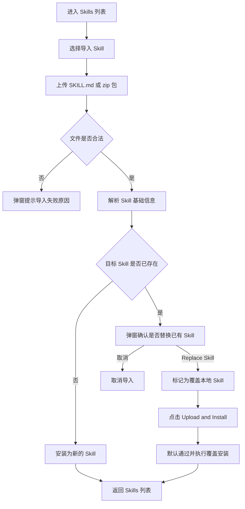
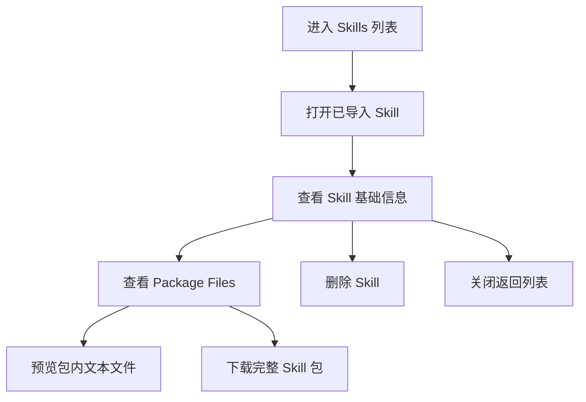

# Skill 导入、安装与导入后查看维护 PRD

## 1. 概述

### 1.1 背景

当前系统中的 Skill 主要通过内置配置或系统内创建方式进入技能库。随着 Skill 数量增长，团队需要支持将本地已有 Skill、外部沉淀 Skill、打包后的 Skill 项目快速导入系统，并在导入后完成查看、覆盖更新和整包下载。

本需求聚焦从“导入 Skill”到“查看已导入 Skill”的完整闭环，让用户能够把符合规范的 Skill 文件或 Skill 包安装到系统中，并在安装后查看基础信息和包内文件。

### 1.2 产品目标

- 支持用户导入已有 Skill 文件或 Skill 包。
- 支持导入后自动安装到技能库，并回到技能列表继续管理。
- 支持查看导入后的 Skill 基础信息和包内文件。
- 支持对已导入 Skill 进行删除和整包下载。
- 支持在目标 Skill 已存在时，按用户选择覆盖本地版本。

## 2. 目标用户与使用场景

### 2.1 目标用户

- Skill 管理员：负责维护系统技能库，导入、更新、删除 Skill。
- 业务配置人员：将业务团队沉淀的 Skill 包导入系统并进行基础维护。
- 实施 / 交付人员：在不同环境间迁移 Skill，并确认导入后的 Skill 内容是否完整。

### 2.2 典型场景

1. 用户已有一个本地 `SKILL.md` 文件，希望快速安装到系统技能库。
2. 用户已有一个包含脚本、reference、配置文件的 Skill zip 包，希望导入后可以查看包内文件。
3. 用户导入的 Skill 与系统中已有 Skill 同名或同 key，需要选择是否覆盖本地版本。
4. 用户进入导入后的 Skill，查看基础信息和包内文件。
5. 用户需要下载完整 Skill 包，用于备份或迁移到其他环境。

## 3. 核心流程

### 3.1 导入并安装 Skill

### 3.2 查看已导入 Skill

## 4. 功能范围

### 4.1 Skill 导入

系统支持用户上传已有 Skill 文件或 Skill 包，并解析其中的 Skill 基础信息。

支持的导入对象：

- `SKILL.md`
- `.md`
- `.markdown`
- `.zip`

文件要求：

- 文件夹或 `.zip` 包必须包含 `SKILL.md` 文件。
- `.md` 文件需包含 YAML frontmatter 格式的 Skill 名称和描述。
- zip 包中允许包含脚本、reference、配置文件等辅助文件。

上传后系统先完成文件解析；若文件格式不支持、zip 包中未找到 `SKILL.md`、`.md` 文件缺少必要 YAML 信息或文件解析失败，应在安装前提示失败原因，不进入安装流程。

导入成功后，仅提示上传文件名。用户确认安装后，Skill 进入技能库。

### 4.2 安装 Skill

用户确认安装后，系统根据解析结果创建或覆盖 Skill。

安装成功后，系统返回 Skills 列表，用户可以从列表进入该 Skill 的详情维护入口。

### 4.3 覆盖已有 Skill

当导入的 Skill 与系统中已有 Skill 冲突时，系统按以下逻辑处理：

1. 上传解析成功后，如果检测到同名或同 key Skill，系统立即弹窗提示是否替换已有 Skill。
2. 如果用户取消替换，则终止本次导入。
3. 如果用户确认 `Replace Skill`，系统记录覆盖意图；后续点击 `Upload and Install` 时不再重复校验或再次弹窗。
4. 内置 Skill 不应被导入包覆盖；且名字不支持与内置 Skill 重名。
5. 覆盖成功后，已有 Skill 的引用关系保持不变，调用方继续使用同一个 Skill 标识。

### 4.4 查看导入后的 Skill

导入后的 Skill 应支持查看以下内容：

- Skill 基础信息：名称、描述。
- Package Files：导入包内的脚本、reference 和配置文件。

导入后的 Skill 基础信息不允许在详情页编辑；Instructions 不在详情页展示。

### 4.5 Package Files 查看

对于包含附加文件的 Skill 包，系统应支持查看包内文件结构。

能力要求：

- 按文件夹层级展示包内文件。
- 文件夹支持展开和收起。
- 用户点击文件后，可以预览文本类文件内容。
- 对于不支持预览的文件，系统提示该文件类型无法在线预览。
- 支持下载完整 Skill 包。

Package Files 用于帮助用户确认导入包是否完整，尤其是脚本、reference 和配置文件是否随 Skill 一起进入系统。

### 4.6 更新 Skill

导入包 Skill 不支持在详情页直接编辑基础信息或 Instructions。若需更新导入包内容，应通过重新导入并覆盖已有 Skill 完成。

### 4.7 删除 Skill

用户可以删除可编辑 Skill。

删除前系统需要提示影响范围，说明该 Skill 删除后将无法继续被相关数字员工调用。

删除成功后：

- Skill 从技能库移除。
- 相关数字员工无法继续调用该 Skill，但删除前不要求用户手动解除引用。
- 历史执行记录保留。

## 5. 业务规则

### 5.1 文件解析规则

- 系统优先识别 `SKILL.md` 作为 Skill 定义文件。
- 如果上传的是 zip 包，系统需在包内查找 `SKILL.md`。
- Skill 名称和描述来自 YAML frontmatter。
- 包内其他文件作为 Package Files 供导入后查看。

### 5.2 Skill 冲突识别

系统需要根据 Skill 标识判断是否存在冲突。

冲突场景包括：

- 导入包声明的 Skill 标识已存在。
- 系统根据 Skill 名称生成的目标标识已存在。

发生冲突时，用户必须明确选择是否覆盖已有 Skill。

### 5.3 覆盖处理规则

- 覆盖后保留目标 Skill 标识。
- 覆盖后使用导入包中的名称、描述和包文件内容。
- 覆盖不应影响历史执行记录。
- 覆盖失败时，原 Skill 内容应保持不变。

### 5.4 下载 Skill 包规则

- 用户可以下载完整 Skill 包。
- 下载结果应包含导入后保存的 Skill 文件及其附属文件。
- 下载包必须还原原始上传包结构，便于迁移和复用。

## 6. 异常与边界处理

### 6.1 文件不合法

当上传文件不符合要求时，系统应阻止安装，并给出明确原因。

常见错误：

- 文件类型不支持。
- zip 包无法解压。
- zip 包内未找到 `SKILL.md`。
- Markdown 文件缺少 YAML frontmatter。
- YAML 内容无法解析。
- 必要信息缺失。

### 6.2 Skill 已存在

当目标 Skill 已存在时，系统在上传解析完成后提示用户确认是否替换。

用户确认替换后，安装阶段不再重复弹出冲突提示。

当用户确认替换但目标 Skill 不可编辑时，系统应阻止覆盖。

### 6.4 文件预览失败

当 Package Files 中某个文件无法预览时，系统应提示该文件类型不支持在线预览或文件加载失败。

此类失败不应影响 Skill 的查看、更新或下载。

## 7. 权限与安全

- 只有具备 Skill 管理权限的用户可以导入、更新、删除 Skill。与skill权限体系保持一致
- 内置 Skill 不能被导入包覆盖。
- 删除 Skill 前应提示影响范围，避免误删正在被数字员工使用的 Skill。
- 对于脚本类文件，本需求只支持查看和随包保存，不涉及脚本执行授权扩展。

## 8. 待确认项

1. [待确认] 是否限制上传文件大小和 zip 包解压后总大小。
2. [待确认] 是否需要过滤系统隐藏文件，例如 `.DS_Store`。
5. 下载完整 Skill 包时，必须完全还原原始上传包结构。
6. 删除 Skill 时不强制解除所有数字员工引用，仅在删除前提示影响范围。

