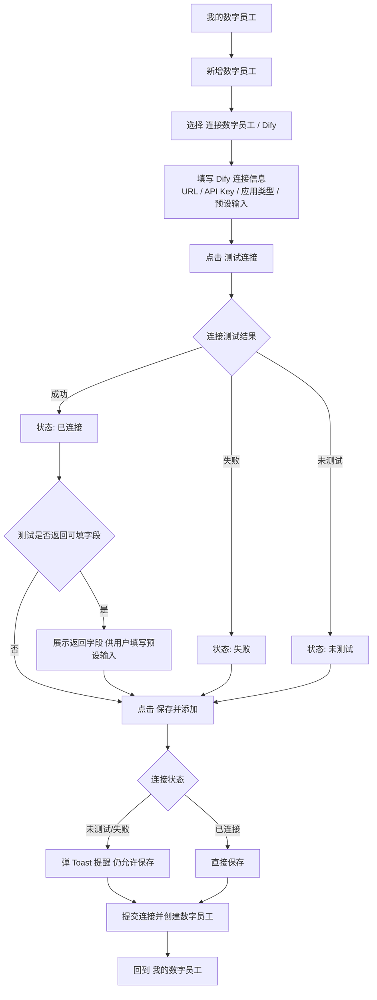
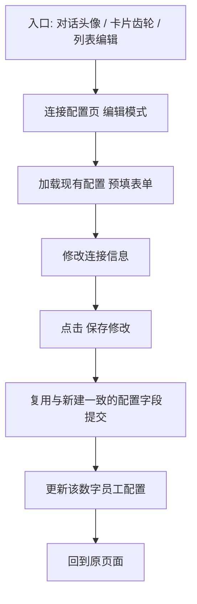

# 连接数字员工 PRD

## 1. 概述

### 1.1 背景

在「我的数字员工」中，用户此前只能原生创建数字员工。本期新增「连接数字员工」能力：用户可将 Dify 等外部 Agent 接入系统，作为数字员工在对话、群组、任务中使用。

- 本期仅实现 **Dify** 一种连接渠道，架构上预留其他外部 Agent / 模型服务的接入空间。
- 本期范围说明：本 PRD 聚焦「连接数字员工」这一核心能力（Dify）。员工管理列表真实数据、删除二次确认、卡片连接方式标签、Silicon WorkMate 导航样式等其它改动不在本 PRD 范围内，作为独立变更项跟踪。

### 1.2 产品目标

- 支持在「我的数字员工」中通过「连接数字员工」新增外部 Agent 类型的数字员工（本期：Dify）。
- 连接过程支持「测试连接」校验，并在未测试 / 失败时以软拦截方式保存（Toast 提示但允许保存）。
- 已连接的数字员工支持编辑，且编辑复用与新建一致的配置字段。
- 统一配置入口：对话页外部 Agent 头像、卡片齿轮均可跳转至连接配置页（编辑模式）。

## 2. 目标用户与使用场景

### 2.1 目标用户

- 业务配置人员 / 实施人员：将团队已有的 Dify 应用接入为数字员工。
- 管理员：维护已连接的数字员工配置。
- 终端用户：在对话与卡片中通过统一入口进入连接配置。

### 2.2 典型场景

1. 用户已有 Dify 应用，希望在「我的数字员工」中把它接入为可用数字员工。
2. 用户填写 Dify 连接信息后点击「测试连接」，验证连通性后再保存。
3. 用户未测试或测试失败也想先保存，系统以 Toast 提醒但仍完成保存。
4. 用户后续需要修改已连接员工的配置，通过编辑模式进入，字段与新建一致。
5. 在对话中点击外部 Agent 头像，或在卡片点击齿轮，直接进入该员工的连接配置页。

## 3. 核心流程

### 3.1 连接并新增数字员工

### 3.2 编辑已连接数字员工

## 4. 功能范围

### 4.1 连接入口

- 在「我的数字员工」新增数字员工的流程中，提供「连接数字员工」通道（本期渠道：Dify）。
- 用户选择连接后进入连接配置页，填写外部 Agent 连接信息。

### 4.2 填写连接信息（Dify）

- 必填：Dify 服务地址（URL）、API Key、应用类型（有默认值 chatflow）。
- 选填字段及说明见 5.2（预设输入、角色标题、描述等）。

### 4.3 测试连接

- 提供「测试连接」动作，依据返回结果维护连接状态：未测试 / 已连接 / 失败。
- 凭据变化（URL / API Key / 应用类型）时，连接状态重置为「未测试」，需重新验证。
- 测试连接成功后，可能返回需要用户补充填写的字段（如 Dify 开始节点变量），系统展示这些字段供用户填写预设输入；若无返回字段，则无需补充填写，直接进入保存。

### 4.4 软拦截保存

- 当状态为「未测试」或「失败」时点击保存，仍允许保存成功，仅以 Toast 提醒（见第 5 章）。
- 状态为「已连接」时直接保存。
- 保存成功后回到「我的数字员工」列表。

### 4.5 编辑模式复用

- 已连接的数字员工支持编辑，进入编辑模式后加载其现有配置预填表单。
- 编辑提交复用与新建一致的连接配置字段，保证配置统一，不产生两套表单。

### 4.6 统一配置入口

- 对话页中外部 Agent 头像点击 → 跳转连接配置页（编辑该员工）。
- 数字员工卡片齿轮点击 → 跳转连接配置页（编辑模式），配置字段与新建一致。

## 5. 字段填写与提示规则

### 5.1 必填字段

| 字段 | 说明 | 缺失时处理 |
| --- | --- | --- |
| Dify 服务地址（URL） | 外部 Agent 的访问地址 | 阻止保存，提示必填项 |
| API Key | 访问外部 Agent 的密钥 | 阻止保存，提示必填项 |
| 应用类型 | chatflow / agent / workflow 等（默认 chatflow） | 已有默认值，必填 |
| 名称 | 连接后数字员工的名称 | 阻止保存，提示必填项 |

### 5.2 选填字段

| 字段 | 说明 | 备注 |
| --- | --- | --- |
| 预设输入（preset inputs） | 开始节点变量默认值 | 选填；仅当测试连接返回可填字段时建议填写 |
| 角色标题 | 数字员工角色 | 选填，不填则使用默认 |
| 描述 | 数字员工描述 | 选填，不填则使用默认 |

### 5.3 各类 Toast 提示

所有 Toast 均置顶展示并自动消失，不阻断用户操作。

**一、测试连接相关**

| 触发场景 | 提示类型 | 文案 |
| --- | --- | --- |
| 测试连接成功 | 成功（绿） | 连接成功 |
| 测试连接失败 | 失败（玫红） | 连接失败（可附原因） |

**二、保存相关**

一次保存可能依次出现「软拦截提醒」与「保存结果」两类提示，两者性质不同、不冲突。

| 触发场景 | 提示性质 | 提示类型 | 文案 |
| --- | --- | --- | --- |
| 未测试连接即保存 | 软拦截提醒 | 提醒（琥珀） | 尚未测试连接，已为你保存，但该员工可能无法正常对话 |
| 连接测试失败后保存 | 软拦截提醒 | 提醒（玫红） | 连接测试失败，已为你保存，但该员工可能无法正常对话 |
| 已连接状态保存 | 软拦截提醒 | 无提示 | 直接保存，不弹 Toast |
| 新建保存成功 | 保存结果 | 成功（绿） | 已创建数字员工 |
| 编辑保存成功 | 保存结果 | 成功（绿） | 已更新数字员工 |
| 保存失败 | 保存结果 | 失败（玫红） | 保存失败（可附原因） |

### 5.4 校验提示

- 必填字段缺失拦截：URL、API Key、名称为空时，保存前拦截并提示具体缺失项（字段定义见 5.1）。
- 凭据变更：URL / API Key / 应用类型变更后，连接状态重置为「未测试」（见 4.3），需重新测试；软拦截仍允许直接保存并以 Toast 提醒（见 4.4）。

## 6. 业务规则

### 6.1 渠道范围

- 本期仅支持 Dify 一种连接渠道；后续可扩展其他外部 Agent / 模型服务。

### 6.2 连接状态与保存

- 连接状态仅三态：未测试 / 已连接 / 失败。
- 保存软拦截规则见 4.4：未测试 / 失败均允许保存并触发 Toast 提醒；已连接直接保存。

### 6.3 配置字段一致性

- 新建与编辑使用同一套连接配置字段（见 4.5），避免配置漂移。

## 7. 异常与边界处理

### 7.1 测试连接失败

- 测试失败不阻止保存，按 4.4 软拦截处理（Toast 提醒仍允许保存）。

### 7.2 凭据变更

- 修改 URL / API Key / 应用类型后，连接状态重置为未测试（见 4.3 / 5.4），需重新验证后再保存。

### 7.3 连接信息填写不完整

- 必填项（URL、API Key、名称）缺失时，阻止保存并提示具体必填项（见 5.1 / 5.4）。

### 7.4 编辑并发

- 编辑保存进行中禁用提交，防止重复提交。

## 8. 权限与安全

- 连接与编辑数字员工需与既有数字员工权限体系一致。
- 凭据加密 / 脱敏存储，不在前端明文展示。
- 仅具备相应权限的用户可连接 / 编辑数字员工。

