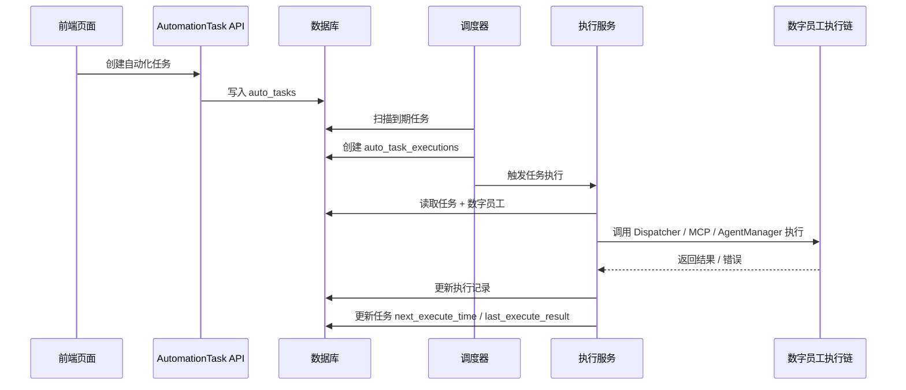

# 自动化任务开发 SPEC_V1

## 1. 文档目的

本文档基于现有 PRD 与当前前端原型页面，输出自动化任务模块的研发落地方案，重点回答以下问题：

- 用户创建的自动化任务，最终通过什么机制被执行完成
- 现有数字员工、Skill、MCP、Knowledge 能力如何接入自动化任务执行链路
- 前端任务列表页、添加任务抽屉、执行历史页分别需要哪些后端接口与数据结构

本文档默认 V1 目标是：

- 支持用户创建单次 / 每日 / 每周 / 每月自动化任务
- 到达计划时间后，系统自动调度指定数字员工执行
- 执行结果、失败原因、重试情况写入执行历史
- 前端页面可查看任务列表、编辑任务、查看执行历史

---

## 2. 结论先行

### 2.1 用户创建的任务通过什么被执行完成

自动化任务不是由前端页面执行完成，而是通过以下后端链路完成：

1. 用户在前端创建任务，后端将任务配置持久化到 `auto_tasks` 表
2. 调度器持续扫描到期任务，找到 `next_execute_time <= now` 且状态为启用的任务
3. 调度器为本次执行创建一条 `auto_task_executions` 执行记录，并把任务投递给执行服务
4. 执行服务加载该任务绑定的数字员工
5. 执行服务读取数字员工的 `tool_ids`、`knowledge_ids`、`action_guide`
6. 执行服务复用现有 `DispatcherService / mcp_server / AgentManager` 体系，驱动数字员工完成任务
7. 执行结束后回写执行结果、失败原因、重试次数、耗时，并刷新任务的 `last_execute_result` 与 `next_execute_time`

一句话概括：

**自动化任务 = 调度器负责“何时执行”，数字员工执行链负责“如何完成”。**

### 2.2 V1 推荐实现原则

- 新增“自动化任务调度层”，不要重写数字员工执行引擎
- 任务执行统一复用现有数字员工直接执行能力
- V1 优先走“单数字员工直执行”链路，不做多员工协作编排
- 推荐结果中展示 Skill / MCP / Knowledge，但用户不可手动配置这些底层能力

---

## 3. 现有系统可复用能力

### 3.1 可复用的数据基础

当前后端已有 `AIEmployee` 模型，已具备自动化任务执行所需的核心能力字段：

- `tool_ids`: 该数字员工可用的 Skill / Tool 能力集合
- `knowledge_ids`: 该数字员工绑定的知识库集合
- `action_guide`: 数字员工的 SOP / 行动指南 / 偏好配置

这意味着自动化任务不需要单独再设计一套“执行能力配置模型”，可以直接复用数字员工现有能力配置。

### 3.2 可复用的执行主链

当前代码里已经存在数字员工直接执行链路：

- `backend/app/services/dispatcher_service.py`
- `backend/app/mcp_server.py`
- `backend/app/agent_manager.py`

其中关键能力如下：

1. `DispatcherService.resolve_employee_id(...)`
   负责解析本轮执行应由哪个数字员工承担。

2. `mcp_server._get_employee_skills(...)`
   根据数字员工的 `tool_ids` 加载可用 Skill；必要时可补充搜索能力。

3. `search_employee_knowledge(...)`
   按请求内容检索数字员工绑定知识库，构造知识上下文。

4. `mcp_server._build_employee_context(...)`
   将 persona、skills、workflow candidates、action guide 组装到执行 Prompt 中。

5. `mcp_server._answer_direct_for_employee(...)`
   在给定数字员工的前提下，完成一次“直接执行”。

6. `AgentManager.get_execution_manager(...)`
   当前注释已明确其主链为：`Dispatcher -> Planner -> Real Tool/Workflow Execution`。

### 3.3 本次自动化任务不建议重写的部分

以下能力已有基础，不建议在 V1 重做：

- Skill 装载机制
- MCP 工具注册机制
- 数字员工知识库检索机制
- 执行 Prompt 拼装逻辑
- 基于数字员工上下文的实际执行代理

V1 只需要新增：

- 自动化任务模型
- 自动化任务调度器
- 自动化任务执行封装服务
- 自动化任务列表 / 历史接口

---

## 4. 总体架构

### 4.1 模块分层

建议新增以下模块：

- `backend/app/routers/automation_tasks.py`
- `backend/app/services/automation_task_service.py`
- `backend/app/services/automation_scheduler_service.py`
- `backend/app/services/automation_executor_service.py`
- `backend/app/services/automation_recommendation_service.py`

### 4.2 职责拆分

#### `automation_task_service.py`

负责任务管理：

- 创建任务
- 编辑任务
- 删除任务
- 开始 / 暂停任务
- 计算 `next_execute_time`
- 查询任务列表

#### `automation_scheduler_service.py`

负责调度：

- 定时扫描到期任务
- 领取可执行任务
- 创建执行记录
- 触发执行服务
- 处理重试与下一次调度时间

#### `automation_executor_service.py`

负责真正执行：

- 读取任务配置
- 加载数字员工
- 加载 Skill / MCP / Knowledge 上下文
- 调用现有 Dispatcher / MCP / AgentManager 执行链
- 回写执行结果

#### `automation_recommendation_service.py`

负责推荐：

- 根据任务内容推荐数字员工
- 返回推荐理由
- 返回候选数字员工的 Skill / MCP / Knowledge 摘要

---

## 5. 任务执行时序

### 5.1 创建任务时序

1. 前端抽屉提交任务名称、任务类型、任务内容、执行时间、开始时间、结束时间、employee_id
2. 后端校验任务合法性
3. 后端计算首个 `next_execute_time`
4. 写入 `auto_tasks`
5. 返回任务详情给前端列表页

### 5.2 自动执行时序

1. 调度器每 30 秒或 60 秒扫描一次待执行任务
2. 找出符合条件的任务：
   - `task_status = enabled`
   - `next_execute_time <= now`
   - `start_time <= now`
   - `end_time is null or end_time >= now`
3. 为本次执行创建 `auto_task_executions`
4. 执行服务开始执行，状态置为 `running`
5. 加载数字员工与其能力上下文
6. 调用现有执行链完成任务
7. 成功：
   - 执行记录置为 `success`
   - 写入 `result_summary / result_detail`
   - 计算下一次执行时间
   - 更新任务表 `last_execute_result`
8. 失败：
   - 执行记录置为 `failed` 或 `retrying`
   - 写入 `error_message`
   - 若未超过重试上限，写入下次重试时间
   - 若超过重试上限，保留任务启用状态，但本次记录终态为失败

### 5.3 Mermaid 时序图



---

## 6. 核心设计决策

### 6.1 调度器选型

V1 建议使用两层方案：

#### 开发环境 / 单机部署

使用 `APScheduler` 或 FastAPI 启动时挂载的后台轮询任务。

优点：

- 上手快
- 易于本地联调
- 与当前单体后端形态匹配

#### 生产建议

将调度器单独作为后台 worker 进程运行，避免与 Web 进程耦合。

原因：

- Web 多实例部署会导致重复调度风险
- 独立 worker 更适合做任务领取、锁控制、失败重试

### 6.2 V1 不建议直接复用 Chat 作为执行载体

虽然当前系统执行链大量围绕 `chat_id` 运转，但自动化任务不应依赖用户手工进入 Chat 才能执行。建议：

- 每个自动化任务执行可创建一个内部 `system chat` 或 `execution session`
- 该 session 不一定暴露给用户，但用于复用现有执行链的上下文结构

建议做法：

1. 为自动化任务创建一个隐藏 chat_id
2. 每次自动执行时，以该 chat_id 驱动数字员工执行
3. 执行结果同步写入 `auto_task_executions`
4. 如后续需要“从任务结果跳转到聊天上下文”，可复用该 chat_id

### 6.3 数字员工如何完成任务

自动化任务执行时，数字员工的完成路径应为：

1. 读取数字员工 `persona_prompt`
2. 读取数字员工 `tool_ids`
3. 用 `tool_ids` 装载 Skill / MCP 工具能力
4. 用 `knowledge_ids` 做知识检索，构造知识上下文
5. 用 `action_guide` 作为执行 SOP 约束
6. 将“任务内容 + 执行时间上下文 + 数字员工上下文”拼成执行 Prompt
7. 调用执行代理完成任务

也就是说，**任务能不能完成，本质上取决于：该数字员工是否拥有匹配的工具能力、知识上下文和 SOP 约束。**

---

## 7. 数据模型设计

### 7.1 新增任务表 `auto_tasks`

| 字段 | 类型 | 说明 |
| --- | --- | --- |
| id | bigint | 主键 |
| task_name | string | 任务名称 |
| task_type | enum | 单次 / 每日 / 每周 / 每月 |
| task_content | text | 任务内容 |
| user_id | string/int | 创建者 |
| employee_id | int | 执行数字员工 ID |
| employee_source | string | admin_created / personal_created |
| execute_rule | string | 调度表达式 |
| start_time | datetime | 开始时间 |
| end_time | datetime | 结束时间 |
| next_execute_time | datetime | 下次执行时间 |
| last_execute_time | datetime | 最近执行时间 |
| last_execute_result | text | 最近执行结果摘要 |
| task_status | enum | enabled / paused / ended / deleted |
| unread_result_count | int | 未读结果数 |
| hidden_chat_id | int | 自动化任务绑定的内部 chat |
| created_at | datetime | 创建时间 |
| updated_at | datetime | 更新时间 |

### 7.2 新增执行记录表 `auto_task_executions`

| 字段 | 类型 | 说明 |
| --- | --- | --- |
| id | bigint | 主键 |
| task_id | bigint | 关联任务 |
| task_name | string | 冗余任务名称 |
| task_type | enum | 单次 / 每日 / 每周 / 每月 |
| employee_id | int | 本次执行数字员工 |
| employee_name | string | 冗余数字员工名称 |
| planned_execute_time | datetime | 计划执行时间 |
| start_time | datetime | 实际开始时间 |
| end_time | datetime | 实际结束时间 |
| execute_status | enum | pending / running / success / failed / retrying / skipped |
| trigger_type | enum | scheduled / retry |
| retry_count | int | 重试次数 |
| result_summary | text | 结果摘要 |
| result_detail | text | 结果详情 |
| error_message | text | 错误信息 |
| raw_response | json/text | 原始返回，可选 |
| created_at | datetime | 创建时间 |
| updated_at | datetime | 更新时间 |

### 7.3 与现有表的关系

- `auto_tasks.employee_id -> ai_employees.id`
- `auto_tasks.hidden_chat_id` 可关联 `chat_messages.chat_id`
- 若执行过程中需要工作流，可关联现有 `workflow_runs`

---

## 8. API 设计

### 8.1 任务管理接口

#### `POST /automation-tasks`

创建任务。

请求体：

```json
{
  "task_name": "每周 AI 行业简报",
  "task_type": "每周",
  "task_content": "汇总本周 AI 行业动态、重点融资与新品发布信息，并输出简报。",
  "employee_id": 1,
  "execute_time": "17:00",
  "start_time": "2026-04-29",
  "end_time": null
}
```

#### `GET /automation-tasks`

任务列表查询。

支持参数：

- `keyword`
- `task_type`
- `task_status`
- `page`
- `page_size`

#### `GET /automation-tasks/{task_id}`

任务详情。

#### `PUT /automation-tasks/{task_id}`

编辑任务。

#### `POST /automation-tasks/{task_id}/start`

开始任务。

#### `POST /automation-tasks/{task_id}/pause`

暂停任务。

#### `DELETE /automation-tasks/{task_id}`

删除任务。

### 8.2 推荐接口

#### `POST /automation-tasks/recommend-employees`

基于任务内容推荐数字员工。

返回字段建议：

```json
[
  {
    "employee_id": 1,
    "employee_name": "AI 情报分析员",
    "source": "管理员创建",
    "reason": "适合行业动态汇总、信息检索与结构化输出类任务。",
    "skills": ["行业情报检索", "摘要生成", "结构化写作"],
    "mcps": ["Tavily Search", "网页抓取"],
    "knowledge_bases": ["AI 行业观察库", "投融资事件库"],
    "score": 0.92
  }
]
```

### 8.3 执行历史接口

#### `GET /automation-task-executions`

查询执行历史。

支持参数：

- `task_id`
- `keyword`
- `task_type`
- `execute_status`
- `start_date`
- `end_date`
- `sort_by=execute_time`
- `sort_order=desc`

#### `GET /automation-task-executions/{execution_id}`

查看执行详情。

---

## 9. 执行服务设计

### 9.1 核心方法

建议在 `automation_executor_service.py` 中提供以下方法：

```python
class AutomationExecutorService:
    def execute_task(self, task_id: int) -> None:
        ...

    def _prepare_execution_context(self, task) -> dict:
        ...

    def _run_employee_execution(self, task, execution_record, chat_id: int) -> dict:
        ...

    def _mark_execution_success(self, execution_record, result) -> None:
        ...

    def _mark_execution_failed(self, execution_record, error) -> None:
        ...
```

### 9.2 推荐复用方式

V1 推荐优先复用 `mcp_server._answer_direct_for_employee(...)`，把自动化任务内容作为用户请求输入执行。

建议执行 Prompt 至少包含：

- 当前任务名称
- 当前任务类型
- 当前执行时间
- 任务内容
- 输出要求

示例：

```text
你正在执行一个自动化任务。

任务名称：每周 AI 行业简报
任务类型：每周
本次执行时间：2026-05-01 17:00
任务内容：汇总本周 AI 行业动态、重点融资与新品发布信息，并输出简报。

请基于你当前可用的技能、MCP 工具和知识库完成任务，并返回结构化结果摘要。
```

### 9.3 为什么优先走 direct execution

V1 的自动化任务大多数是“固定内容、定时重复执行”，更适合稳定的直接执行模式：

- 路径更短
- 行为更可预测
- 执行时间更短
- 更适合定时任务批量运行

仅当后续出现复杂多步流程时，再扩展到 workflow skill 执行。

---

## 10. 调度器设计

### 10.1 轮询频率

建议每 30 秒扫描一次到期任务。

### 10.2 任务领取逻辑

为避免重复执行，调度器必须具备“领取”语义。建议：

1. 先查出候选任务
2. 创建执行记录时将状态设为 `pending`
3. 通过数据库事务更新任务的“本轮已领取标记”或直接更新 `next_execute_time`
4. 只有领取成功的任务才进入执行

若当前项目暂不做复杂锁，可先用以下简化方案：

- 单实例后端 + 单实例调度器
- V1 明确不支持多实例并发调度

### 10.3 单次任务处理

单次任务执行成功后：

- 本次执行记录标记为 `success`
- 任务状态自动转为 `ended`
- `next_execute_time = null`

这也是当前 PRD 中“待确认项”的建议默认答案。

### 10.4 重试逻辑

建议字段：

- `retry_count`
- `next_retry_time`

规则：

- 最多重试 3 次
- 重试间隔 10 分钟
- 重试期间执行记录状态显示为 `retrying`
- 最终失败后保留完整失败原因

---

## 11. 前端对接说明

### 11.1 任务列表页对应字段

当前前端 `AutomationTaskListPage.jsx` 已经体现了以下展示模型：

- `name`
- `summary`
- `cycle`（应统一命名为 `taskType`）
- `nextExecuteTime`
- `employeeName`
- `status`
- `latestResult`
- `hasUnreadResult`

后端返回建议：

```json
{
  "id": "tsk-001",
  "taskName": "每周 AI 行业简报",
  "taskType": "每周",
  "summary": "每周五 17:00 汇总 AI 行业动态与重点融资事件",
  "nextExecuteTime": "2026-05-01 17:00",
  "employeeName": "AI 情报分析员",
  "status": "enabled",
  "latestResult": "已完成 4 月第 4 周行业简报",
  "hasUnreadResult": true
}
```

### 11.2 添加任务抽屉对应字段

当前前端抽屉需要的字段：

- `name`
- `content`
- `employeeId`
- `cycle`（建议改名 `taskType`）
- `executeTime`
- `startDate`
- `endDate`

建议前端下一步同步把 `cycle` 字段命名统一成 `taskType`，与 PRD 和历史页一致。

### 11.3 推荐卡片接口返回

当前前端已经展示：

- 数字员工名称
- 来源类型
- 推荐理由
- Skill
- MCP
- Knowledge

因此推荐接口要直接返回这三类能力摘要，避免前端二次拼装。

### 11.4 执行历史页对应字段

当前前端 `AutomationTaskHistoryPage.jsx` 需要：

- `taskName`
- `taskType`
- `executeTime`
- `completeTime`
- `executeStatus`
- `duration`
- `resultSummary`
- `triggerType`
- `employeeName`
- `inputContent`
- `resultDetail`
- `errorMessage`
- `retryCount`
- `retryRecords`

且当前页面已按 `executeTime desc` 展示，后端接口也应默认按该顺序返回。

---

## 12. 推荐服务设计

### 12.1 推荐输入

- 任务内容
- 当前用户 ID

### 12.2 推荐逻辑

V1 推荐使用规则打分即可：

1. 从当前用户可见数字员工池中取候选人
2. 按任务内容关键词与数字员工描述 / 工具 / 知识库做匹配打分
3. 输出 Top N 推荐结果

### 12.3 推荐结果中的 Skill / MCP / Knowledge 从哪里来

- Skill：来自数字员工 `tool_ids` 映射到 skill registry 后得到名称
- MCP：来自 Skill 绑定的 MCP 工具，或数字员工可访问的 MCP server 摘要
- Knowledge：来自数字员工 `knowledge_ids` 对应的知识库名称

V1 可以先返回摘要名称，不必展开底层参数。

---

## 13. 异常与边界

### 13.1 数字员工被删除

- 任务不删除
- 任务状态改为 `paused`
- 列表展示“执行主体失效”

### 13.2 数字员工能力变更

- 若 `tool_ids` 或 `knowledge_ids` 变化导致执行失败，执行记录保留失败原因
- 用户重新编辑并保存任务后，再恢复启用

### 13.3 到期任务堆积

- V1 可串行执行
- 若同一时间到期任务过多，按 `next_execute_time asc, created_at asc` 排队执行

### 13.4 执行超时

- 执行服务应设置单次任务超时
- 超时后记为失败，并进入重试逻辑

---

## 14. 实施建议

### Phase 1：打通最小闭环

- 新增 `auto_tasks` / `auto_task_executions` 两张表
- 新增任务管理 API
- 新增推荐 API
- 新增单机调度器
- 执行服务复用 `_answer_direct_for_employee`
- 打通列表页 / 添加任务抽屉 / 历史页

### Phase 2：补全稳定性

- 重试逻辑
- 未读结果计数
- 调度器幂等与锁
- 单次任务自动结束

### Phase 3：增强执行能力

- workflow skill 自动执行
- 更复杂推荐策略
- 执行日志与可观测性增强

---

## 15. 最终建议

对于“用户创建的任务通过什么可以执行完成”这个问题，研发实现上建议定为：

**通过一个新增的自动化任务调度器，在到期时触发自动化任务执行服务；执行服务再复用现有数字员工执行链，结合数字员工的 Skill、MCP、Knowledge 与 Action Guide，完成任务执行。**

这条方案的好处是：

- 贴合当前代码结构
- 研发成本最低
- 不需要重做数字员工执行引擎
- 前端页面可以快速对接真实数据
- V1 足够稳定，且后续可扩展到 workflow 和更复杂调度